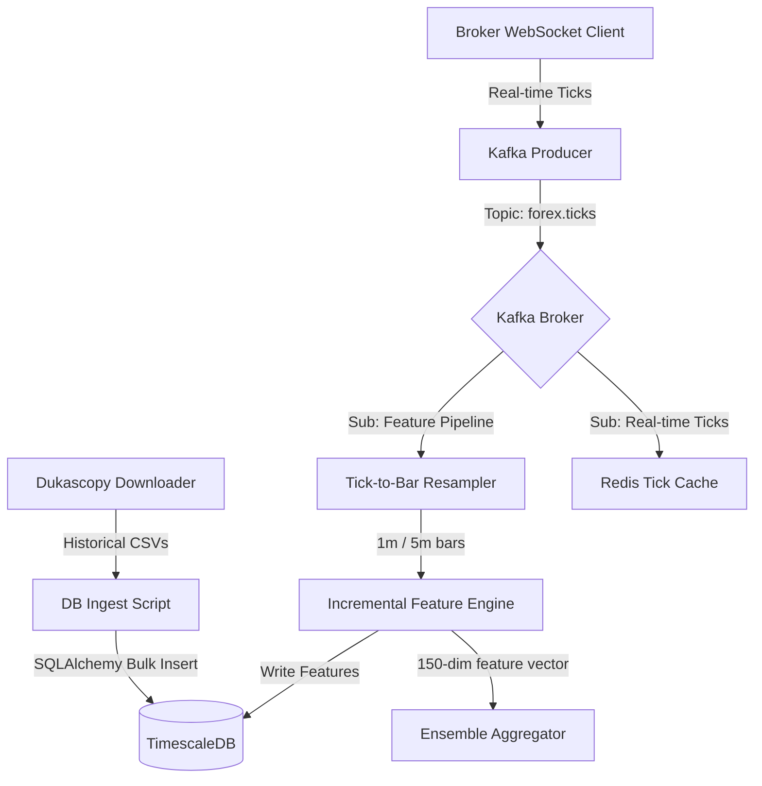
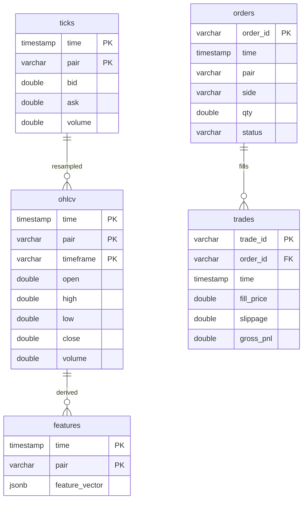

# DATA FLOW
## Forex Neural Trading Engine — Real-time & Historical Data Flow

This document details the data ingestion, streaming, feature extraction, and database persistence layers of the Forex Neural Trading Engine.

---

## 1. High-Level Ingestion Flow

The system supports two execution paths:
1. **Historical Mode (Backtesting)**: Data handlers load historical ticks/bars from TimescaleDB and feed them into the event loop sequentially.
2. **Live/Paper Mode**: Real-time tick streams are ingested via Broker WebSockets, forwarded to a Kafka message bus, resampled in real-time, and cached in Redis.



---

## 2. Ingestion & Storage Schemes

### TimescaleDB Declarative Models
Relational entities map to high-performance hyper-tables inside TimescaleDB:
* **`ticks`**: Tick-by-tick records tracking bid, ask, and volume.
* **`ohlcv`**: OHLCV bars aggregated across standard periods (1m, 5m, 1h, 4h, 1d).
* **`features`**: Pre-computed feature vectors aligned to timestamps.
* **`orders`**: Record of placed order requests, states, and client parameters.
* **`trades`**: Confirmed fills, execution prices, slippage statistics, and attribution.



---

## 3. Real-time Feature Pipeline & Caching

To prevent future leakage and maintain low latency:
1. **Redis Cache**: Maintains a sliding buffer of the last 1000 ticks per pair. This allows instant query-free access to microstructure properties (e.g. spread, bid-ask volume imbalance).
2. **Incremental vs. Batch Equivalence**:
   - During **batch offline training**, features are vectorized across historical SQL rows.
   - During **live trading**, the incremental feature pipeline computes updates on a single incoming tick or 1m bar without reloading history.
   - Both modes share the exact same mathematical implementations, validated by `test_pipeline_equivalence_incremental_vs_batch`.

---

## 4. Message Bus Topology (Kafka Topics)

Kafka coordinates execution across decoupled processing boundaries:

| Topic Name | Producer | Consumers | Event Payload Description |
|---|---|---|---|
| `forex.ticks` | WebSocket Adapter / Simulation | Resampler, Redis Monitor | Real-time tick details (bid, ask, volume, timestamp) |
| `forex.features` | Resampler & Feature Pipeline | Models, Monitoring | Computed 150-dimensional feature arrays |
| `forex.signals` | Ensemble Aggregator | Risk Engine | Alpha direction, magnitude, and uncertainty bounds |
| `forex.orders` | Risk Engine | Execution Engine, Portfolios | Gated, sized, and routed order packets |
| `forex.fills` | Broker API Client / Fill Simulator | Portfolio Monitor, Ledger | Filled trade prices, slippage, and timestamp details |

---

## 5. Event Loop Flow Control

The `TradingPipeline` event loop processes events chronologically:

```
[Market Tick] -> Ingestion (Kafka) -> Resampling -> Feature Pipeline -> Model Ensemble -> Risk Gating -> Order Routing -> Broker API -> Fill Attribution
```

This sequence guarantees:
* **Production Parity**: Backtesting feeds simulated ticks into the exact same pipeline.
* **Stateless Flow**: Every stage receives input event packets and outputs new packets, avoiding global mutable state.
