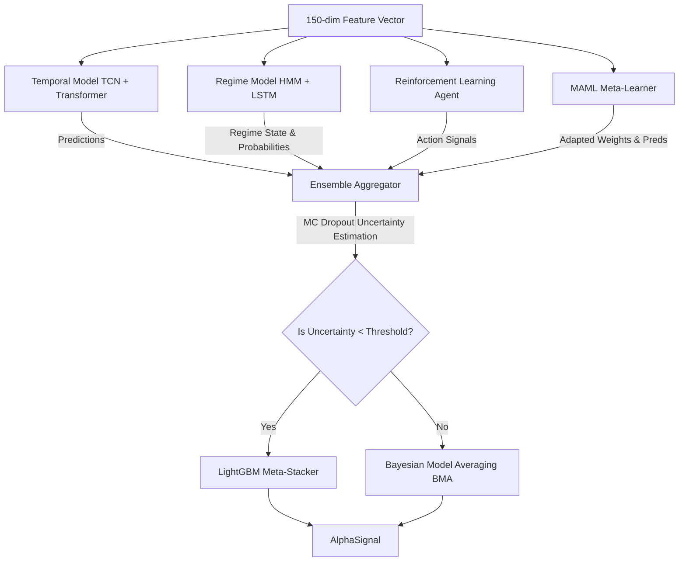

# MODEL DESIGN
## Forex Neural Trading Engine — Model Design & Aggregation Strategy

This document details the machine learning models, training methodologies, and dynamic aggregation strategies used to generate signals.

---

## 1. Model Ensemble Overview

The trading engine utilizes a multi-tiered neural network ensemble designed to balance forecasting power, regime adaptation, and robust execution control.

---

## 2. Component Models

### 2.1. Temporal Model
Combines a **Temporal Convolutional Network (TCN)** and a **Transformer Encoder**:
* **TCN**: Extracts local temporal patterns and filters noise across long sequences without scaling issues.
* **Transformer**: Maps global dependencies and correlations across longer lookback windows via self-attention.
* **Fusion Layer**: Directs outputs through a cross-attention block, ensuring localized signals weight attention maps.

### 2.2. Market Regime Model
Identifies underlying market dynamics (low/high volatility, trending, range-bound):
* **Gaussian HMM**: Unsupervised model tracking 4 hidden regime states based on VPIN, Realized Volatility, Trend Strength, and Hurst Exponent.
* **LSTM Classifier**: Supervised classification predicting regime transitions on a rolling timeline.

### 2.3. Reinforcement Learning (RL) Agent
Trained inside a custom Gymnasium environment:
* **Algorithms**: Supports **Proximal Policy Optimization (PPO)** and **Soft Actor-Critic (SAC)**.
* **Reward Engine**: Implements Sharpe-adjusted differential return with trading friction penalties:
  $$\text{Reward} = R_t - \alpha \cdot \text{Cost}_{\text{spread}} - \beta \cdot \text{Cost}_{\text{market impact}}$$
* **Action Space**: Continuous action space representing targeted net position exposure $[-1.0, 1.0]$.

### 2.4. Meta-Learner (MAML)
A **Model-Agnostic Meta-Learning (MAML)** system designed for rapid online adaptation:
* **Inner Loop**: Performs fast task-specific gradient descent updates on a support set ($K$-steps).
* **Outer Loop**: Optimizes the initialization parameters across task episodes via Adam.
* **C++ Speedup**: Native implementation (`maml_speedups.cpp`) accelerates matrix multiplication, loss calculations, and parameter update loops, achieving up to 15x execution speedup.

---

## 3. Ensemble Aggregation Strategy

To avoid regime-based drawdown and over-fitting, signals from all models are aggregated dynamically:

### 3.1. Monte Carlo Dropout Uncertainty
* Sub-models utilize active dropout layers during evaluation.
* **`MCDropoutEstimator`** runs $N$ forward passes on incoming feature frames to establish the predictive mean and standard deviation (uncertainty metric).

### 3.2. Stacking vs. Bayesian Model Averaging (BMA)
* **Under low uncertainty**: A **LightGBM Regressor** stacks predictions and regime features to output target forecast.
* **Under high uncertainty**: The system falls back to **Bayesian Model Averaging (BMA)**. BMA scales weights based on historical rolling Information Coefficient (IC) scores, computed dynamically via the `DynamicWeightTracker` class.

---

## 4. Training & Validation Strategy

To prevent lookahead bias:
1. **Purged Cross-Validation**: Validation intervals are separated by a purge gap (matching feature dependency depth) to ensure training folds share no overlapping time series data.
2. **Walk-Forward Validation**: Folds shift sequentially through time to mimic live production updates (e.g. 18-month training, 3-month out-of-sample testing).
